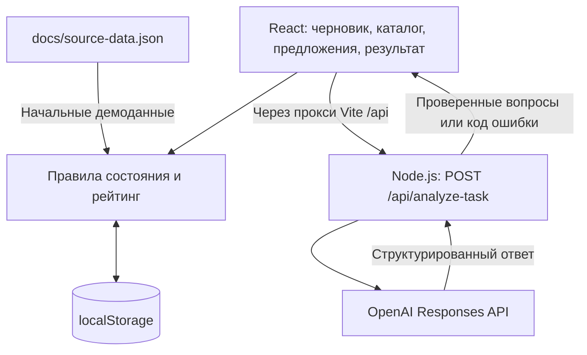

# NomadEX

**NomadEX — прототип платформы, которая помогает бизнесу сформулировать понятную задачу, получить предложения студенческих команд и подтвердить результат работы.**

Бизнесу бывает сложно описать проблему, ожидаемый результат и критерии приёмки так, чтобы команда могла предложить решение. NomadEX проводит пользователя от исходного описания через уточняющие вопросы к структурированной карточке и общему каталогу. Команды предлагают свои подходы, а окончательное решение принимает представитель бизнеса.

Текущая версия — локальная демонстрация для одного браузера: один профиль бизнеса и пять профилей команд переключаются в интерфейсе. Это не многопользовательский сервис с общей базой данных.

## Что реализовано

- Создание и редактирование нескольких черновиков: название, описание, отрасль и шесть полей постановки задачи.
- Анализ через OpenAI: определение недостающих сведений и 3–6 уточняющих или проверочных вопросов с объяснением их назначения. Ответы добавляются в поля карточки отдельной кнопкой пользователя.
- Локальные шаблонные вопросы по кнопке или при ошибке AI. Интерфейс явно отличает их от ответа OpenAI.
- Рейтинг готовности карточки от 0 до 100 с разбивкой по критериям.
- Подтверждение карточки человеком и публикация в каталоге. Любая правка черновика сбрасывает подтверждение; опубликованная карточка фиксируется.
- Общий для демопрофилей каталог: сортировка по убыванию рейтинга, затем по новизне публикации, при равенстве — по идентификатору.
- Одно предложение от каждой команды на задачу: идея, ожидаемый результат, план, срок, навыки и ссылка на материалы.
- Сравнение предложений бизнесом и выбор одной, нескольких или ни одной команды с отдельным подтверждением. Решение закрывает приём откликов.
- Отправка одного текстового результата выбранной командой и подтверждение бизнесом. Каждый подтверждённый результат даёт команде **+10 баллов** без повторного начисления.
- Сохранение задач, ответов, откликов и результатов в `localStorage`, восстановление после перезагрузки и явный сброс демоданных.

### Как считается рейтинг

| Поле карточки | Вес |
| --- | ---: |
| Проблема и контекст | 20 |
| Ожидаемый результат | 20 |
| Критерии приёмки | 20 |
| Границы задачи | 15 |
| Данные и ресурсы | 15 |
| Сроки и ограничения | 10 |

Вес начисляется целиком, если поле заполнено после нормализации. Пустые значения и предусмотренные кодом формулировки вроде «не знаю» считаются неизвестными. Рейтинг отражает **заполненность**, а не правдивость сведений или качество бизнеса; содержательную проверку проводит человек. AI не выставляет баллы. Низкий рейтинг не мешает публикации и откликам, а баллы команд не меняют порядок каталога.

## Как работает решение

1. Представитель бизнеса создаёт черновик и описывает проблему.
2. Запускает анализ, отвечает на вопросы и переносит нужные ответы в поля карточки.
3. Проверяет текущую версию, подтверждает её и публикует задачу.
4. Команды открывают каталог и отправляют предложения.
5. Бизнес сравнивает подходы, планы и сроки, затем подтверждает выбор команд.
6. Выбранная команда отправляет описание выполненной работы.
7. Бизнес подтверждает результат; команда получает 10 баллов.

AI участвует только в уточнении постановки задачи. Публикация, выбор исполнителей и подтверждение результата остаются действиями человека.

## Технологии

| Часть | Реализация |
| --- | --- |
| Язык | TypeScript |
| Интерфейс | React 18, React DOM, обычный CSS |
| Разработка и сборка | Vite 6, TypeScript 5.7, `tsx`, `concurrently` |
| Состояние и хранение | React `useReducer`, браузерный `localStorage` |
| Проверка данных | Zod 3: запросы, ответы AI, сохранённое состояние и связи сущностей |
| Сервер анализа | Node.js, встроенный модуль `node:http`, `dotenv` |
| AI-интеграция | Официальный SDK `openai` 7.23.0, Responses API, Structured Outputs с JSON Schema |
| Модель | Задаётся через `OPENAI_MODEL`; в `.env.example` указана `gpt-4o-mini` |
| Тесты | Встроенный `node:test`, запуск TypeScript-тестов через `tsx` |

## Архитектура



Бизнес-данные обрабатываются в браузере. Сервер предоставляет только анализ описания: проверяет вход, обращается к OpenAI и проверяет выход. Он не хранит задачи и не обслуживает аккаунты. При ошибке клиент формирует локальные вопросы и показывает причину перехода на резервный режим.

| Путь | Назначение |
| --- | --- |
| `src/App.tsx` | Переключение демопрофилей, разделов и задач |
| `src/DraftEditor.tsx`, `src/TaskView.tsx` | Редактор и опубликованная карточка |
| `src/Proposals.tsx`, `src/ResultPanel.tsx` | Отклики, решение бизнеса и результаты |
| `src/store.ts` | Схема состояния, правила действий, каталог, баллы и сохранение |
| `src/rating.ts`, `src/analysis.ts` | Расчёт рейтинга и клиент анализа с резервными вопросами |
| `src/storage.ts` | Чтение и перенос прежних локальных черновиков |
| `shared/contract.ts`, `shared/prompt.ts` | Общий AI-контракт и системный промпт |
| `server/app.ts`, `server/index.ts` | HTTP endpoint и запуск сервера |
| `docs/source-data.json` | Исходный демонстрационный набор |
| `tests/`, `scripts/check-openai.ts` | Автотесты и отдельная проверка реального AI-запроса |

## Установка и запуск

### 1. Подготовить окружение

Нужны **Node.js 22.12.0 или новее** и npm. Выполняйте команды из терминала. Если PowerShell блокирует `npm.ps1`, используйте `npm.cmd` вместо `npm` во всех командах ниже.

```sh
git clone https://github.com/BAITC-Hacks/hack-6669e5b1-nomadex.git
cd hack-6669e5b1-nomadex
npm ci
```

Если репозиторий уже скачан, перейдите в его папку и выполните только `npm ci`.

### 2. Настроить AI при необходимости

Для демонстрации с локальными подсказками ключ не требуется. Для реального анализа скопируйте `.env.example` в `.env`:

```powershell
# Windows PowerShell
Copy-Item .env.example .env
```

```sh
# macOS / Linux
cp .env.example .env
```

Заполните `.env`:

```dotenv
OPENAI_API_KEY=ваш_ключ
OPENAI_MODEL=gpt-4o-mini
PORT=8787
```

| Переменная | Назначение |
| --- | --- |
| `OPENAI_API_KEY` | Ключ для реальных запросов к OpenAI |
| `OPENAI_MODEL` | Доступная вашему проекту модель с поддержкой используемого формата ответа; для AI обязательна |
| `PORT` | Порт локального сервера анализа, по умолчанию `8787` |

`.env` исключён из Git. Ключ используется только сервером; его не нужно добавлять в клиентский код или переменные `VITE_*`. После изменения настроек перезапустите приложение. Реальный анализ требует сети и доступного лимита OpenAI API.

### 3. Запустить приложение

```sh
npm run dev
```

Команда одновременно запускает интерфейс и сервер анализа. Откройте [http://127.0.0.1:5173](http://127.0.0.1:5173). Сервер анализа слушает `127.0.0.1:8787`, если порт не изменён. Vite проксирует `/api` на этот сервер. Порт `5173` должен быть свободен: автоматический переход на другой порт отключён.

Без ключа можно нажать **«Локальные подсказки»**. Кнопка **«Найти пробелы и вопросы»** при отсутствии конфигурации также покажет локальные вопросы с пояснением.

### 4. Проверить сборку

```sh
npm run check
```

Команда последовательно проверяет типы, запускает тесты и собирает интерфейс в `dist/`. Тесты AI используют подменённый транспорт и не делают внешних запросов.

Для просмотра собранного интерфейса запустите в двух терминалах:

```sh
# Терминал 1
npm run server
```

```sh
# Терминал 2, после npm run build или npm run check
npm run preview
```

Откройте адрес, выведенный Vite. `preview` предназначен для локальной проверки сборки; сервер анализа запускается отдельно.

## Как проверить решение: сценарий для жюри

Сценарий выполняется в одной вкладке с переключением поля **«Демо-профиль»**. При необходимости начните со **«Сбросить демоданные»**: это удалит созданные в приложении задачи и изменения, вернув исходный набор.

1. В профиле **«Представитель бизнеса»** нажмите **«Новая задача»**. Название: `Единый список заявок`. Описание: `Заявки приходят из разных каналов и теряются между таблицами. Менеджерам нужен единый список со статусами.`
2. Нажмите **«Локальные подсказки»** либо, при настроенном ключе, **«Найти пробелы и вопросы»**. Ожидаемый результат: 3–6 вопросов, обозначение режима и отсутствие автоматических изменений полей.
3. Ответьте на один вопрос и нажмите **«Добавить ответ в поле…»**. Затем заполните шесть полей по примеру:

   | Поле | Пример значения |
   | --- | --- |
   | Проблема и контекст | Менеджеры вручную сводят заявки из нескольких таблиц и пропускают обращения. |
   | Ожидаемый результат | Веб-прототип списка заявок со статусами и краткая инструкция. |
   | Критерии приёмки | На 10 тестовых заявках можно создать запись, изменить статус и найти заявку. |
   | Границы задачи | Список и статусы входят в первую версию; платежи и CRM-интеграция исключены. |
   | Данные и ресурсы | Используем 10 вымышленных заявок, реальные данные не требуются. |
   | Сроки и ограничения | Демонстрация через неделю; работа только с тестовыми данными. |

   Ожидаемый рейтинг — **100/100**. Это пример ввода для проверки платформы, а не уже реализованный в NomadEX сервис обработки заявок.
4. Отметьте **«Я проверил текущую версию карточки»**, затем измените любое поле: подтверждение должно сброситься. Подтвердите повторно и нажмите **«Опубликовать в каталоге»**. Карточка появится в каталоге без возможности редактирования.
5. Переключитесь на **DataCraft**, откройте созданную задачу и заполните предложение: идея — `Сделаем таблицу заявок со статусами`; результат — `Веб-прототип`; план — `Согласовать поля`, `Собрать прототип`, `Проверить сценарий` (каждый шаг с новой строки); срок — `Одна неделя`; ссылка — `https://example.com` (тестовый адрес). Нажмите **«Отправить предложение»**. Повторный отклик этой команды недоступен.
6. Вернитесь в профиль бизнеса, откройте задачу, отметьте DataCraft, нажмите **«Проверить решение»**, затем **«Подтвердить выбор команд»**. Приём новых предложений закроется. Для проверки сравнения до этого шага можно отправить второй отклик от Interface Lab.
7. В профиле DataCraft откройте эту же задачу и отправьте текст результата, например `Подготовлен демонстрационный прототип; сценарий проверен на 10 вымышленных заявках`. До подтверждения бизнеса баллы команды остаются **0** при исходном состоянии демо.
8. От имени бизнеса нажмите **«Подтвердить результат и начислить +10»**. Переключитесь на DataCraft: должно быть **10 баллов**. Перезагрузите страницу на том же адресе: задача, результат и баллы сохранятся, рейтинг задачи останется **100/100**.

Дополнительно в любом черновике раскройте **«Проверка AI для демонстрации»** и нажмите **«Проверить неверный ответ»**. Некорректный ответ должен быть отклонён, карточка сохранена, а вопросы заменены локальными.

### Отдельная проверка реального OpenAI

После настройки `.env` выполните:

```sh
npm run check:openai
```

Скрипт поднимает временный локальный endpoint и отправляет один синтетический пример. Успех — код выхода `0`, `mode: "openai"` и валидные вопросы. Без ключа или модели возвращается код `2`, при ошибке проверки — `1`; локальный резерв здесь не используется. Проверка делает реальный API-запрос.

В [протоколе проверки MVP](docs/mvp-verification.md) за 23 сентября 2026 года зафиксированы 47 пройденных тестов, успешная сборка, сквозной браузерный сценарий и отдельные реальные запросы OpenAI. Это сохранённый протокол; доступность модели и ключа в новом окружении проверяется отдельно.

При подготовке этого README в Windows повторно прошли **46 из 47 тестов**; проверка типов и отдельно запущенная сборка также прошли. Проверка `request limits and published prompt match the contract` не извлекает блок промпта из документа с окончаниями строк CRLF: её регулярное выражение ожидает LF. Поэтому `npm run check` в таком окружении завершается на тестах до этапа сборки. Это ограничение существующего теста, не результат реального AI-запроса.

## Данные и интеграции

- **Исходные данные:** [docs/source-data.json](docs/source-data.json) — один вымышленный бизнес, пять черновиков, пять опубликованных задач, пять команд и пять откликов. Результаты изначально отсутствуют. Набор подключён непосредственно в коде приложения.
- **Описание и дополнительный формат:** [source-data.md](docs/source-data.md) и [source-data.csv](docs/source-data.csv). CSV не является работающим импортом через интерфейс. Упомянутые в примерах таблицы, расписания и отзывы не приложены как реальные материалы заказчиков.
- **Пользовательский ввод:** описание задачи, поля карточки, ответы на вопросы, предложения и тексты результатов. Основное сохранение — ключ `nomadex-state-v2` в `localStorage` для текущего адреса приложения.
- **Внешний сервис:** OpenAI Responses API. При анализе передаются описание, шесть полей карточки и предыдущие ответы. Запрос использует `store: false`; серверный таймаут — 15 секунд, автоматические повторы SDK отключены. Ответ проверяется на сервере и клиенте.
- **Локальный API:** `POST /api/analyze-task`, JSON на входе, проверенный анализ либо `{ "code": "…" }` при ошибке. Полная схема описана в [AI-контракте](docs/ai-contract.md).
- **Ссылки предложений:** новые предложения принимают HTTP(S)-ссылки на материалы; приложение не загружает их содержимое. Ссылки исходного набора ведут к демонстрационным описаниям предложений в интерфейсе.

## Ограничения текущей версии

- Нет регистрации, настоящей авторизации, общей серверной БД и синхронизации между устройствами. Демопрофили и проверки ролей обеспечивают сценарий интерфейса, но не защищают данные от владельца браузера.
- Параллельная работа нескольких вкладок и разрешение конфликтов не поддерживаются. Данные относятся к конкретному адресу приложения и могут быть потеряны при очистке хранилища браузера.
- Опубликованные задачи, отправленные предложения и результаты нельзя редактировать; окончательный выбор команд нельзя пересмотреть. На выбранный отклик предусмотрен один результат без возврата на доработку.
- Нет поиска и фильтров каталога, уведомлений, чата, загрузки файлов и пользовательского импорта/экспорта.
- Рейтинг проверяет заполненность полей, но не их смысловую достаточность. AI-вопросы требуют проверки человеком; текущий результат анализа не сохраняется после закрытия редактора, хотя введённые ответы сохраняются.
- Локальные подсказки — шаблонный резерв, а не результат работы модели. Доступность реального AI зависит от ключа, модели, сети и лимитов внешнего API.
- Сервер слушает только локальный адрес. Публичная эксплуатация с аккаунтами, серверной проверкой прав и защитой от чрезмерных запросов в этой версии не реализована.

Планы развития вынесены в [post-mvp-roadmap.md](docs/post-mvp-roadmap.md); перечисленные там будущие функции не входят в текущую реализацию.

## Развёрнутая версия

Ссылка на публично развёрнутую версию в репозитории не указана. Для демонстрации используйте локальный запуск по инструкции выше.
